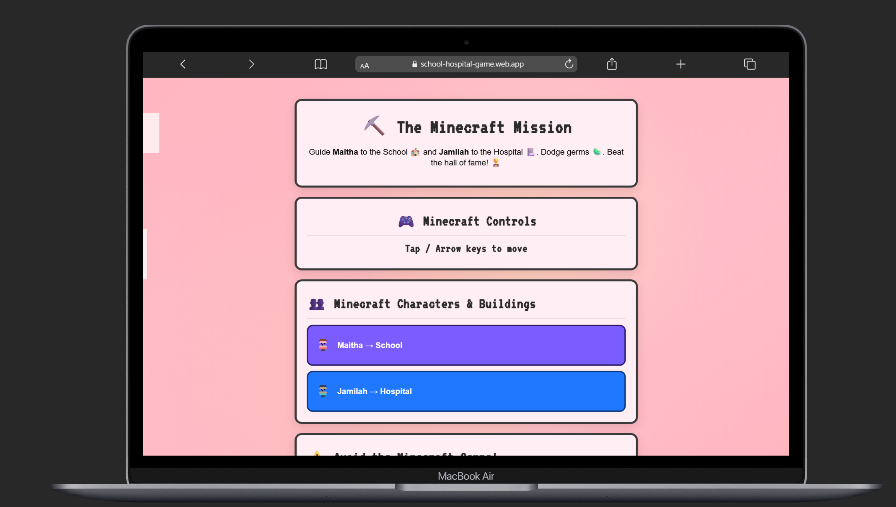

# ⛏️ The Minecraft Mission
> *A Data-Driven Storytelling Studio project by Maitha Alhammadi*

Guide **Maitha** 🏫 and **Jamilah** 🏥 to their destinations.  
Avoid germs, stack your score, and rise in the **Hall of Fame**!

🎮 **Play now:** [school-hospital-game.web.app](https://school-hospital-game.web.app)  
🎞️ **Watch demo:** below 👇  

  

---

## ✨ Features
- 🎬 Cinematic intro & immersive mission
- 🦠 Germ obstacles that reduce points
- 🏆 Live leaderboard (Firebase)
- 🔊 Background music + mute toggle
- 📱 Responsive design for all devices

---

## 📸 Screenshots
| Welcome Scene | Mission Brief | Leaderboard |
|:--:|:--:|:--:|
|  |  |  |

| Hall of Fame | End Trophy |
|:--:|:--:|
|  |  |

---

## 🕹️ How to Play
- Move with **arrow keys** or tap controls  
- Reach both destinations  
- Avoid germs (🟥 –10 | 🟩 –5)  
- Finish fast to top the leaderboard!

---

## 🚀 Built With
**HTML**, **CSS**, **JavaScript**, and **Firebase Hosting**  
Made with 💚 in the *Data-Driven Storytelling Studio* class (UTS)

---

## 🪄 Credits
**Developer:** Maitha Alhammadi  
**University:** University of Technology Sydney (UTS)

---
