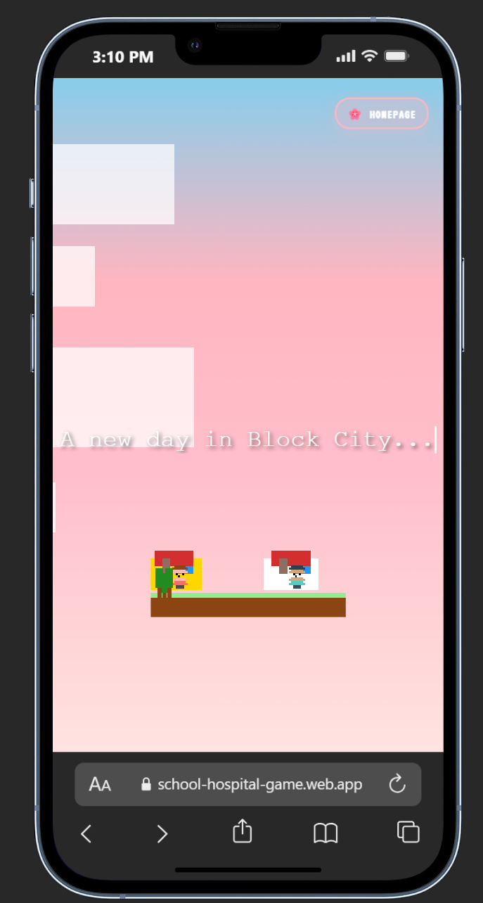
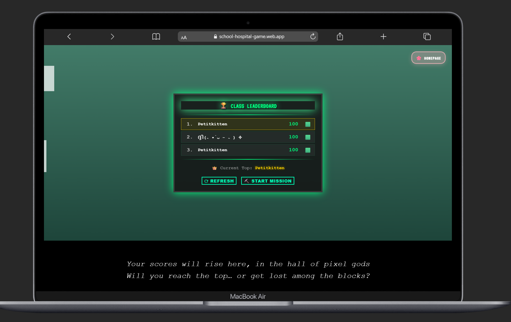
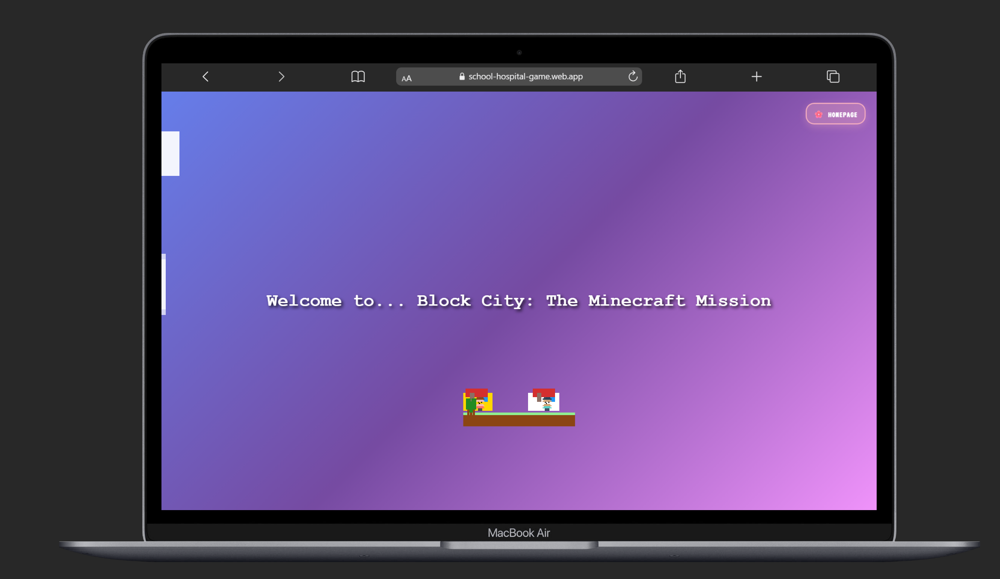
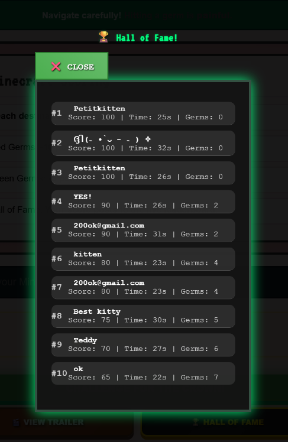

# ⛏️ Block City: The Minecraft Mission

Guide **Maitha** to the 🏫 School and **Jamilah** to the 🏥 Hospital.  
Dodge the germs, beat the class, and claim your spot on the **Hall of Fame**!

**🔗 Play now:** https://school-hospital-game.web.app

> **🎮 Live Demo:** [Watch the game in action!](https://github.com/MaithaAlhammadi98/Visual_Studio_Game/blob/main/docs/media/gif.gif)

---

## ✨ Features

- 🎮 **Two characters** with separate goals (School / Hospital)
- 🦠 **Germs** that reduce score (green –5, red –10)
- 🏆 **Live leaderboard** (Firestore) with class "Hall of Fame"
- 🎥 **Cinematic intro** + welcome card
- 🔊 **Chiptune music** with **Mute/Unmute** toggle
- 📱 **Mobile-first** UI, responsive on iPhone/iPad/Mac
- ⚔️ **Challenge system** - "Challenge [TopPlayer] for the crown!"
- 🎨 **Minecraft aesthetic** - Pixel-perfect graphics and UI

---

## 📸 Screenshots

<p align="center">
  <br>
  <em>Welcome Cinematic</em>
</p>

<p align="center">
  <br>
  <em>Mission Brief</em>
</p>

<p align="center">
  <br>
  <em>Leaderboard (Class)</em>
</p>

<p align="center">
   <br>
  <em>Hall of Fame & End Trophy</em>
</p>

---

## 🕹️ How to Play

- **Move**: Arrow keys (or tap controls on mobile)
- **Goal**: Maitha → School, Jamilah → Hospital
- **Avoid**: germs (they cost points)
- **Win**: Reach both targets; your score saves automatically
- **Compete**: Challenge the current champion for the crown!

---

## 🚀 Run / Deploy

### Local
Just open `index.html` in a browser.  
*(If you use modules or want a local server)*:
```bash
# Python
python3 -m http.server 8080
# or Node
npx http-server -p 8080
```

### Firebase Hosting

This repo is already set up for Firebase.

```bash
npm i -g firebase-tools
firebase login
firebase init hosting      # (choose existing project)
firebase deploy
```

Live URL (current): **[https://school-hospital-game.web.app](https://school-hospital-game.web.app)**

---

## 🧱 Tech

* HTML/CSS/JS (vanilla)
* Firebase Firestore + Hosting
* Pixel art / emojis for UI flavor
* Web Audio API for immersive sound
* Canvas 2D for smooth game rendering

---

## 🔐 Notes on Security

* Public Firebase web config is expected (client-side).
* Do **not** commit any admin/service keys.
* If you introduce build tooling later, use `.env` (and commit `.env.example` only).

---

## 📜 License

MIT — see [LICENSE](./LICENSE).

---

## 🙌 Credits

* Design & development: **Maitha Alhammadi**
* Course: *Data-Driven Storytelling Studio* (UTS)
* Thanks to classmates & test players!

---

## 🎮 Game Features Deep Dive

### 🎬 **Cinematic Experience**
- **8-scene epic intro** with typewriter effects
- **Character introductions** with pixel art portraits
- **Germ threat reveal** with dramatic animations
- **Controls tutorial** with interactive demos
- **Race path preview** showing both destinations
- **Leaderboard reveal** with glowing scoreboard
- **Welcome sequence** with Block City title
- **Mission briefing** with game summary

### ⚔️ **Competitive System**
- **Dynamic challenge messages** - "Can you dethrone [TopPlayer]?"
- **Live leaderboard updates** - Real-time like Kahoot!
- **Admin panel** - Full game control and monitoring
- **Player tracking** - See who's playing and when
- **Score history** - Complete game attempt records

### 🎨 **Minecraft Aesthetic**
- **Hand-drawn pixel characters** - Maitha and Jamilah
- **Block City environments** - Pixelated garden and buildings
- **Minecraft UI elements** - Buttons, modals, and effects
- **Pixel-perfect graphics** - Crisp, authentic Minecraft feel
- **Color-coded scoring** - Red germs (-10), Green germs (-5)

### 🎵 **Audio Experience**
- **Background music** - Custom Minecraft-themed tracks
- **Sound effects** - Germ hits, celebrations, transitions
- **Rain and thunder** - Atmospheric weather effects
- **Victory sounds** - Bravo celebrations and success chimes
- **Mute controls** - Player preference saving

---

## 🏆 Achievements

### ✨ **Game Features**
- ✅ **2-Player Adventure** - Maitha & Jamilah
- ✅ **Live Leaderboard** - Real-time competition
- ✅ **Cinematic Intro** - 8-scene story
- ✅ **Mobile Optimized** - Perfect mobile experience
- ✅ **Admin Panel** - Full game control
- ✅ **Sound System** - Immersive audio
- ✅ **Minecraft Aesthetic** - Pixel-perfect design

### 🎮 **Technical Achievements**
- ✅ **Firebase Integration** - Real-time database
- ✅ **Responsive Design** - All screen sizes
- ✅ **Performance Optimized** - Smooth gameplay
- ✅ **Cross-Platform** - Works everywhere
- ✅ **Accessibility** - Inclusive design

---

<div align="center">

## 🏆 **Ready to Challenge for the Crown?** 👑

[🎮 **PLAY NOW**](https://school-hospital-game.web.app) | [📱 **Mobile Version**](https://school-hospital-game.web.app) | [👑 **Hall of Fame**](https://school-hospital-game.web.app)

**🌟 Made with ❤️ by Maitha Alhammadi 🌟**

*One apply a day, keeps the doctor away!* 🍎

</div>
