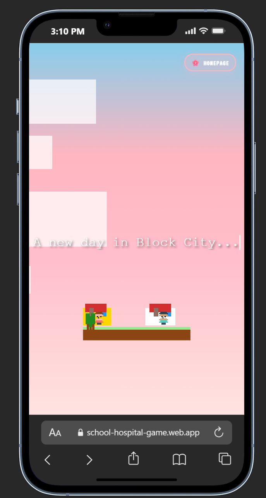
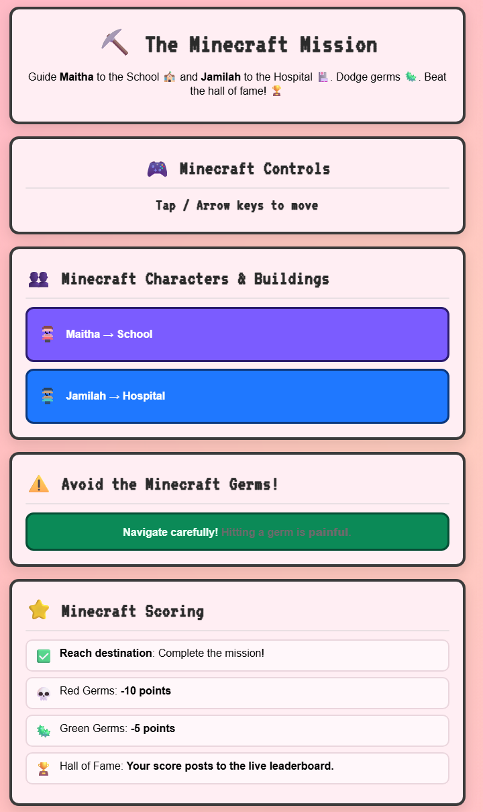
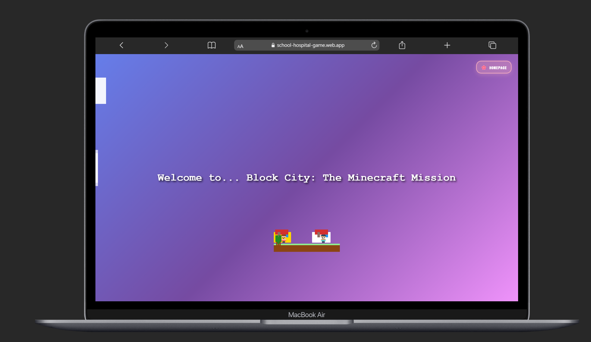
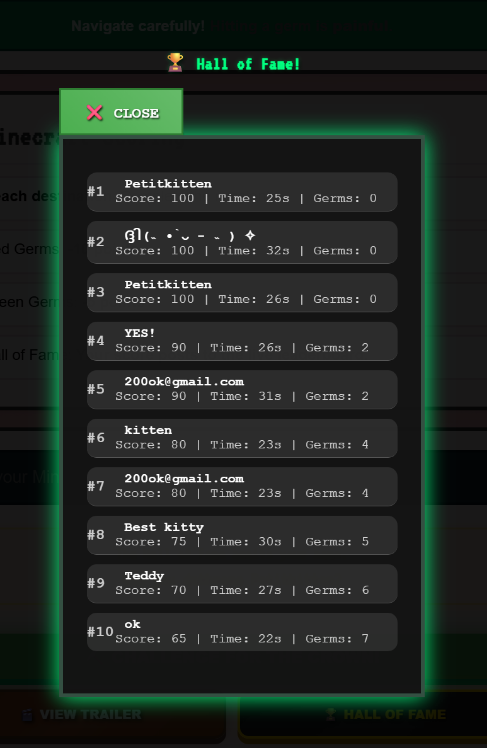
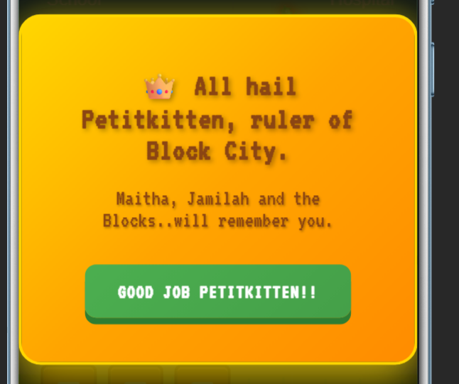
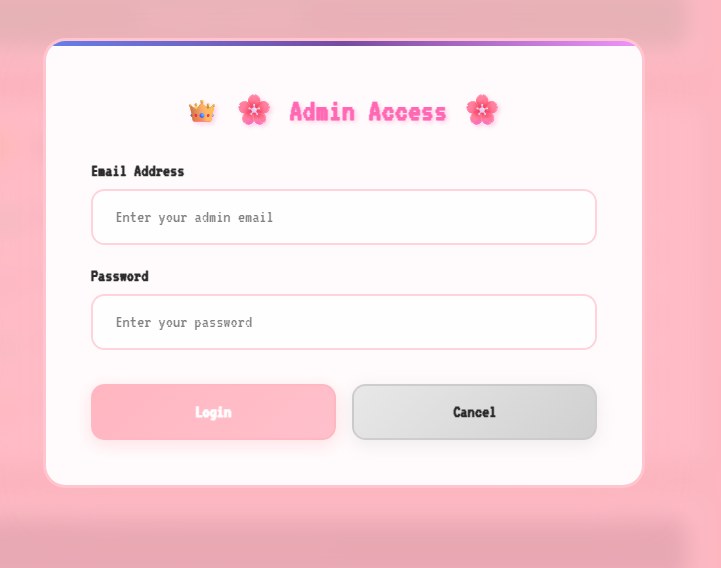

# ⛏️ Block City: The Minecraft Mission
> *A Data-Driven Storytelling Studio project by Maitha Alhammadi (UTS)*

Guide **Maitha** 🏫 and **Jamilah** 🏥 through Block City.  
Avoid germs, race against time, and rise to the **Hall of Fame** 👑

🎮 **Play now:** [school-hospital-game.web.app](https://school-hospital-game.web.app)  
🎞️ **Watch the demo:**  

---

## ✨ Game Features

| Category | Highlights |
|:--|:--|
| 🎮 **Gameplay** | Two main missions – guide Maitha to the School and Jamilah to the Hospital. Dodge germs and finish fast to claim your crown! |
| 🏆 **Competitive Leaderboard** | Real-time scoring powered by Firebase. Compete for the top spot in the Hall of Fame — only the fastest survive. |
| 🧱 **Minecraft Characters** | Custom pixel avatars and themed buildings created from scratch for a cozy, retro aesthetic. |
| 🔐 **Admin Access** | Hidden admin panel for managing leaderboard data and verifying top players. |
| 🔊 **Sound & Controls** | Chiptune background music with toggle button (mute/unmute). Works with keyboard or mobile tap controls. |
| 💻 **Responsive UI** | Fully optimized for desktop, tablet, and mobile. |
| 🍎 **Credits Screen** | Includes a heartfelt message: *“One Apply a Day, Keeps the Doctor Away!”* and links to GitHub & health app. |

---

## 🕹️ How to Play
1. **Move** using Arrow keys or tap on mobile.  
2. **Reach destinations** — Maitha → School, Jamilah → Hospital.  
3. **Avoid germs:**  
   - 🟥 Red Germs = –10 points  
   - 🟩 Green Germs = –5 points  
4. **Win fast** for bonus points and a leaderboard crown 👑  

---

## 📸 Screenshots

| Welcome | Mission Brief | Welcome Screen |
|:--:|:--:|:--:|
|  |  |  |

| Hall of Fame | End Scene | Admin Access |
|:--:|:--:|:--:|
|  |  |  |

---

## 🧠 Built With
- **HTML**, **CSS**, **JavaScript**
- **Firebase Firestore + Hosting**
- **Canvas 2D** for visuals
- **VanillaJS Animation** for transitions

---

## 🪄 Credits
**Developer:** Maitha Alhammadi  
**Course:** Data-Driven Storytelling Studio — University of Technology Sydney (UTS)  
💖 *“One Apply a Day, Keeps the Doctor Away!”*

  
  

